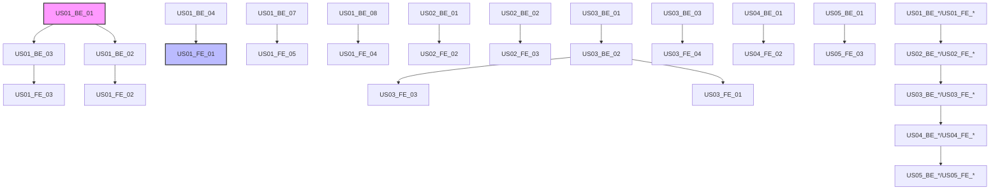

# Dependencies Map

```mermaid
graph TD
  US01_BE_01 --> US01_BE_02
  US01_BE_01 --> US01_BE_03
  US01_BE_03 --> US01_FE_03
  US01_BE_04 --> US01_FE_01
  US01_BE_02 --> US01_FE_02
  US01_BE_07 --> US01_FE_05
  US01_BE_08 --> US01_FE_04
  US02_BE_01 --> US02_FE_02
  US02_BE_02 --> US02_FE_03
  US03_BE_01 --> US03_BE_02
  US03_BE_02 --> US03_FE_03
  US03_BE_02 --> US03_FE_01
  US03_BE_03 --> US03_FE_04
  US04_BE_01 --> US04_FE_02
  US05_BE_01 --> US05_FE_03
  
  %% Historias encadenadas (Sprints / Flujos)
  US01_BE_*/US01_FE_* --> US02_BE_*/US02_FE_*
  US02_BE_*/US02_FE_* --> US03_BE_*/US03_FE_*
  US03_BE_*/US03_FE_* --> US04_BE_*/US04_FE_*
  US04_BE_*/US04_FE_* --> US05_BE_*/US05_FE_*

  style US01_BE_01 fill:#f9f,stroke:#333,stroke-width:2px
  style US01_FE_01 fill:#bbf,stroke:#333,stroke-width:2px
  %% ...
```

## Leyenda
- Flechas = "tarea depende de"
- BE = Backend, FE = Frontend
- "/" = dependencia fluida entre familias de tareas (story-chain)
