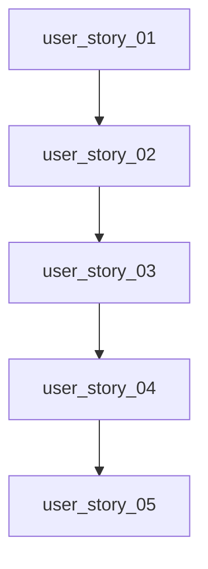

# Backlog Ejecutivo - test_project

## Resumen Ejecutivo
Desarrollo incremental de una aplicación web para gestión de tareas, enfocado en productividad, experiencia de usuario y seguridad (OWASP). El producto permitirá registro/autenticación de usuarios y gestión completa (CRUD) de tareas en una interfaz moderna.

## Roadmap
1. **MVP (Fase 1)**: Autenticación + CRUD básicos tareas.
2. **Mejoras (Fase 2-3)**: UI avanzada, filtros, feedback, performance.
3. **Optimización (Fase 4-5)**: Seguridad robusta, métricas, escalabilidad.

## Épicas
- EPIC_01_AUTH: Autenticación y gestión de usuarios
- EPIC_02_TASKS: CRUD de tareas y gestión
- EPIC_03_UIUX: Experiencia e Interfaz de usuario
- EPIC_04_SECURITY: Seguridad, performance y cumplimiento

## User Stories
- user_story_01, user_story_02, user_story_03, user_story_04, user_story_05

## Priorización
| User Story      | Prioridad | Story Points |
|-----------------|-----------|--------------|
| user_story_01   | HIGH      | 8            |
| user_story_02   | HIGH      | 5            |
| user_story_03   | HIGH      | 5            |
| user_story_04   | MEDIUM    | 3            |
| user_story_05   | LOW       | 3            |

## Mermaid Diagram - Dependencias

## Riesgos
- Password hashing débil - Impacto: HIGH - Mitigación: bcrypt/PBKDF2
- SQL Injection - Impacto: HIGH - Mitigación: SQLAlchemy ORM
- Tokens JWT inseguros - Impacto: HIGH - Mitigación: firmar+caducidad corta
- XSS front - Impacto: MEDIUM - Mitigación: escaping output React

## Definición de Hecho (DoD)
- Código probado >80% coverage
- Peer review y merge seguro
- Documentación y arquitectura
- Seguridad OWASP, test de performance <200ms

## Convenciones
- Nombres en inglés (snake_case)
- PRs sólo tras tests OK y revisión
- Commit mensajes descriptivos
