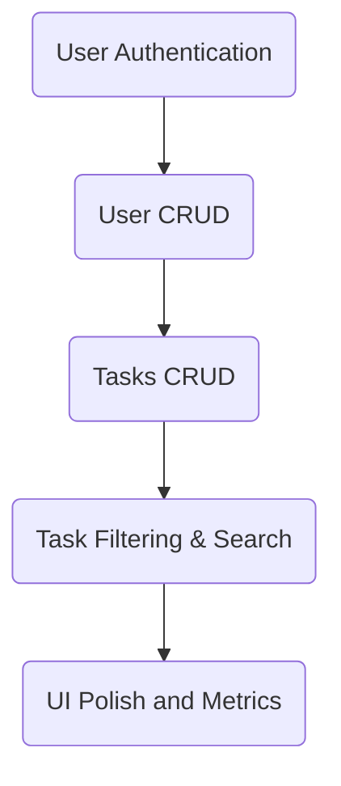

# Dependencies Graph - test_project

## Mermaid Dependency Graph

```mermaid
graph TD
  user_story_01("User Authentication") --> user_story_02("User CRUD")
  user_story_02 --> user_story_03("Tasks CRUD")
  user_story_03 --> user_story_04("Task Filtering & Search")
  user_story_04 --> user_story_05("UI Polish and Metrics")
```

- user_story_01 (epic_01)
- user_story_02 (epic_01)
- user_story_03 (epic_02)
- user_story_04 (epic_03)
- user_story_05 (epic_04)
